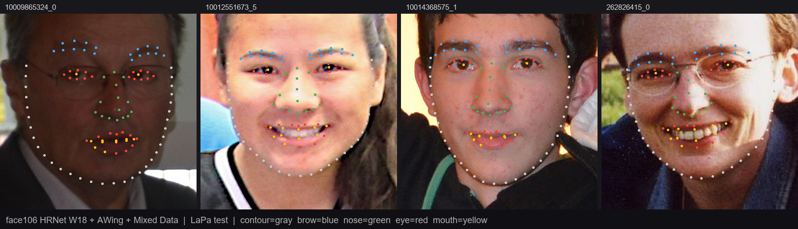

# face106 — 106 点人脸关键点检测

> 一个从零训练的轻量 106 点人脸关键点模型，INT8 量化后 **17.93 MB**，CPU 即可实时推理。
> 在 LaPa 测试集 NME **2.37%**，在 ICME 2019 Test\_data1 NME **3.37%**（FP32 384 推理），相对 ICME 2021 TOP1 (Meituan, NME 4.01%) 改善 **16%**。

中文（默认） | [README.en.md](README.en.md)



*4 张 LaPa 测试集样例上的 106 点预测（INT8 ONNX）。脸郭灰、眉毛蓝、鼻子绿、眼睛红、嘴巴黄。*

---

## 性能

### LaPa 测试集（与训练分辨率 256×256 一致）

| 模型 | 参数量 | 磁盘大小 | NME | acc@0.05 | acc@0.08 | image\_acc@0.08 |
|---|---|---|---|---|---|---|
| HRNet W18 + AWing + Mixed Data（FP32）| 18.3 M | 69.7 MB | **2.16%** | **93.11%** | **97.98%** | **99.55%** |
| 同上 INT8（Conv-Only）| 18.3 M | **17.93 MB** | **2.37%** | 91.83% | **97.60%** | **99.50%** |

### ICME 2019 Test\_data1（与公开竞赛对比）

| 模型 | 推理分辨率 | NME | acc@0.05 |
|---|---|---|---|
| **本项目（FP32, 384 推理）** | 384 | **3.37%** | **82.49%** |
| ICME 2021 TOP1 (Meituan TuringTest) | – | 4.01% | 79.05% |
| ICME 2021 TOP2 (Tencent) | – | 4.21% | 78.25% |
| ICME 2021 TOP3 (Streamax) | – | 4.15% | 75.93% |
| 本项目（FP32, 256 推理）| 256 | 4.03% | 75.13% |
| 本项目（INT8, 256 推理）| 256 | 4.31% | 72.80% |

> 256 推理时已与 ICME 2021 TOP1 持平；上采样到 384 推理后超越 TOP1 16% 相对 NME。
> 注：本模型未受 ICME 比赛对模型大小（≤2 MB）和 FLOPs（≤100 MFLOPs）的限制。

完整训练历程、消融实验和失败记录见 [PROJECT\_SUMMARY.md](PROJECT_SUMMARY.md) 和 [REPORT.md](REPORT.md)。

---

## 三种使用方式

### 1. pip 包（推荐）

```powershell
# 从仓库根构建 wheel
cd ../face106-pkg
py -3.12 -m pip wheel . --no-deps -w dist
py -3.12 -m pip install dist/face106-0.1.0-py3-none-any.whl
```

INT8 ONNX 模型内嵌在 wheel（约 15 MB）。

```python
from face106 import LandmarkDetector
from PIL import Image

detector = LandmarkDetector()                       # 自动加载内置 INT8 ONNX
img = Image.open("face.jpg").convert("RGB")
bbox = (50, 50, 250, 250)                           # 由你自己的人脸检测器提供
landmarks = detector.predict(img, bbox)             # numpy (106, 2)，像素坐标
```

可视化辅助：

```python
from face106 import draw_landmarks
out = draw_landmarks(img, landmarks)
out.save("out.jpg")
```

### 2. 本仓库脚本 demo

`scripts/demo.py` 内置 OpenCV Haar 人脸检测，支持单图与摄像头：

```powershell
# 单图
py -3.12 scripts/demo.py --image path/to/face.jpg --output out.jpg

# 摄像头实时
py -3.12 scripts/demo.py --webcam

# 用 INT8 ONNX 后端
py -3.12 scripts/demo.py --image face.jpg --onnx runs/lapa_hrnet_w18_awing_mixed_e80/model_int8.onnx
```

### 3. 直接调用 ONNX

```python
import onnxruntime as ort
import numpy as np

sess = ort.InferenceSession("runs/lapa_hrnet_w18_awing_mixed_e80/model_int8.onnx")
# 输入：(N, 3, 256, 256) float32，[-1, 1] 归一化，BGR→RGB
# 输出：(N, 106, 2) 归一化坐标 [0, 1]
```

---

## 模型架构

```
输入 256×256×3
   ↓
HRNet W18 backbone（base_channels=32，num_blocks=2）
   ↓
heatmap head → (106, 64, 64)
   ↓
Softmax over spatial → soft-argmax 解码
   ↓
输出 (106, 2) 归一化坐标
```

- 训练阶段使用 `sigmoid + Adaptive Wing Loss`（ω=14, ε=0.5, α=2.1, θ=0.5）。
- 推理阶段使用 soft-argmax，避免 argmax 的不可导和量化失真。
- INT8 量化采用 **Conv-Only** 策略：仅量化 53 个 Conv 节点，保留 Softmax + soft-argmax 解码链为 FP32，将量化退化压到 NME +9.6%。

详细技术决策与消融见 [PROJECT\_SUMMARY.md](PROJECT_SUMMARY.md)。

---

## 训练数据

总计 **113,504 张训练图像**：

| 数据集 | 数量 | 标注来源 |
|---|---|---|
| LaPa train | 18,168 | 官方 106 点人工标注 |
| JD-landmark FLL3 | ~20,000 | 官方 106 点人工标注 |
| Pseudo WFLW | ~75,000 | HRNet 教师模型生成的 106 点伪标签 |

加载与采样逻辑在 [`landmarklab/data.py`](landmarklab/data.py)（`lapa_mixed` dataset 类型 + `WeightedRandomSampler`）。

---

## 复现训练

最终最佳配置：[`configs/lapa_hrnet_w18_awing_mixed.yaml`](configs/lapa_hrnet_w18_awing_mixed.yaml)。

```powershell
# 1. 准备数据
#    - LaPa     → ../data/LaPa/{train,val,test}/
#    - JD       → ../data/jd_landmark/FLL3_dataset/
#    - PseudoWFLW → face106/data/wflw_pseudo_106/train_data.csv

# 2. 启动训练（80 epoch, batch=16, RTX 2080 Ti 22GB 约需 X 小时）
py -3.12 -m landmarklab.train `
    --config configs/lapa_hrnet_w18_awing_mixed.yaml

# 3. 导出 INT8 ONNX（Conv-Only + Percentile 99.999% 校准）
py -3.12 -m landmarklab.export_quant `
    --config configs/lapa_hrnet_w18_awing_mixed.yaml `
    --run runs/lapa_hrnet_w18_awing_mixed_e80 `
    --quant-mode conv_only `
    --calibrate-method Percentile

# 4. 在 ICME 2019 Test_data1 评测
py -3.12 scripts/eval_icme.py `
    --checkpoint runs/lapa_hrnet_w18_awing_mixed_e80/best.pt `
    --test-root ../data/Test_data1 `
    --resolution 384

# INT8 ONNX 评测
py -3.12 scripts/eval_icme_onnx.py `
    --onnx runs/lapa_hrnet_w18_awing_mixed_e80/model_int8.onnx `
    --test-root ../data/Test_data1 `
    --resolution 256
```

冒烟测试（验证 pipeline）：

```powershell
py -3.12 -m landmarklab.train `
    --config configs/lapa_hrnet_w18_awing_mixed.yaml `
    --override train.epochs=1 train.log_interval_steps=20 run_name=smoke
```

---

## 仓库结构

```
face106/
├── landmarklab/
│   ├── core.py            # 损失（含 Adaptive Wing Loss）、指标、几何工具
│   ├── data.py            # LaPa / JD-landmark / PseudoWFLW 数据集与混合 loader
│   ├── model.py           # HRNet W18 + heatmap head
│   ├── train.py           # YAML 驱动训练器（EMA / AMP / Cosine LR / 早停）
│   ├── export_quant.py    # ONNX QDQ INT8 导出（支持 conv_only 和 percentile 校准）
│   └── ssl_pretrain.py
├── configs/
│   ├── lapa_hrnet_w18_awing_mixed.yaml   # 最终最佳配置
│   ├── lapa_lmnet.yaml                   # 早期 LMNet 基线
│   └── ...                               # 多条对比路线的配置
├── scripts/
│   ├── demo.py            # 单图 / 摄像头 demo
│   ├── eval_icme.py       # ICME 2019 Test_data1 评测（PyTorch）
│   ├── eval_icme_onnx.py  # 同上（ONNX 后端）
│   └── preview_lapa.py
├── runs/
│   └── lapa_hrnet_w18_awing_mixed_e80/   # 最终训练产物
│       ├── best.pt        (69.7 MB FP32)
│       ├── model_int8.onnx (17.93 MB)
│       ├── history.csv
│       └── summary.json
├── PROJECT_SUMMARY.md     # 项目总结报告
├── REPORT.md              # 详尽实验日志
├── PAPER.md               # 论文风格写作
├── optimization_log.md
└── README.md
```

---

## 关键经验

- **数据量是关键瓶颈**。仅 18k LaPa 训练时 NME 卡在 2.30%；混入 20k JD + 75k 伪标 WFLW 后掉到 2.16%。
- **Adaptive Wing Loss 比 Wing / MSE 显著更好**，但要注意在 `d → 0` 处用 `clamp(min=1e-6)` 防止数值发散。
- **Conv-Only INT8 量化是关键**。全量化（包括 Softmax）会把 LaPa NME 从 2.30% 推到 4.0%+；只量化 53 个 Conv 节点、保留 Softmax + soft-argmax FP32 后退化压到 +9.6%。
- **训练分辨率 256，推理可用 384**。模型对推理上采样比训练放大更鲁棒，ICME NME 从 4.03% 降到 3.37%。

完整版（含失败实验和未走的路线）见 [PROJECT\_SUMMARY.md](PROJECT_SUMMARY.md) 和 [REPORT.md](REPORT.md)。

---

## 许可证

MIT。LaPa / JD-landmark / WFLW 数据集保留各自原许可证。
