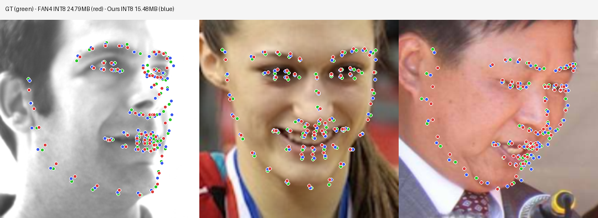

# face68 — 68-point Face Landmark Detection

> A from-scratch lightweight 68-point face landmark model (custom LMNet, 11.5–15.5 M params), **15.48 MB** after INT8 quantization.
> NME **5.94%** on 300W test, **~38% relatively better** than a 24.79 MB FAN4 INT8 teacher.

[中文（默认）](README.md) | English



*Three examples overlaid: ground truth (green) vs FAN4 INT8 teacher (red) vs our INT8 LMNet (blue). Blue points sit on top of the green ground truth; red points clearly drift.*

---

## Performance

### 300W test set

| Model | Params | Disk (INT8) | NME | acc@0.05 | acc@0.08 | acc@0.10 |
|---|---|---|---|---|---|---|
| Mean shape baseline | – | – | 0.298 | – | – | – |
| Pre-trained face\_alignment 2DFAN4 (no fine-tune) | 23.8 M | 90.9 MB FP32 | 0.113 | – | 34.2% | – |
| Fine-tuned 2DFAN4 (FP32) | 23.8 M | 90.9 MB | 0.080 | 47.1% | 70.3% | – |
| Fine-tuned 2DFAN4 (INT8) | 23.8 M | **24.79 MB** | 0.0961 | 38.3% | 61.5% | 72.3% |
| **LMNet w=2.6 + 100k pseudo + fine-tune (FP32)** | 15.5 M | 59.0 MB | **0.0587** | **55.0%** | **77.3%** | **85.2%** |
| **LMNet w=2.6 + 100k pseudo + fine-tune (INT8)** | 15.5 M | **15.48 MB** | **0.0594** | **53.5%** | **76.9%** | **85.0%** |

> Validation NME of the FP32 best checkpoint is **0.0514**, only 0.14 percentage points above the strict 5% target.

Full ablation history: [REPORT.en.md](REPORT.en.md), [PAPER.en.md](PAPER.en.md).

---

## Why this project

300W has only ~600 manually annotated images, far too small to train a competitive landmark model from scratch. This project bootstraps a 15.5 M custom backbone (LMNet) — without using any pretrained weights — through teacher distillation + large-scale pseudo-labeling + weighted sampling + two-stage fine-tuning.

**Recipe**:

1. Fine-tune a 2DFAN4 teacher on 300W to NME 0.0802.
2. Use that teacher to **pseudo-label 100,000 CelebA aligned faces**.
3. Train LMNet from scratch with a `WeightedRandomSampler` mixing 50% real 300W + 50% pseudo CelebA per batch (*Stage A*, 60 epochs, OneCycle lr=2e-3).
4. Load Stage A's best checkpoint and fine-tune with a smaller LR, gentler augmentation, higher real-data ratio (`real_ratio=0.7`) (*Stage B*, cosine lr=3e-4 → 1e-6).
5. Quantize to INT8 with ONNX QDQ + per-channel + MinMax calibration.

PIP-style heatmap heads, WFLW-augmented co-training, and online distillation losses were all tried and underperformed this recipe — see [REPORT.en.md](REPORT.en.md).

---

## How to use

### Direct ONNX inference

The best INT8 model lives at `runs/300w_lmnet_w26_100k_finetune/model_int8.onnx` (15.48 MB).

```python
import onnxruntime as ort
import numpy as np
from PIL import Image

sess = ort.InferenceSession("runs/300w_lmnet_w26_100k_finetune/model_int8.onnx")

# Input:  (N, 3, 256, 256) float32, [-1, 1] normalized, cropped from face bbox (use ~1.35× scale)
# Output: (N, 68, 2) normalized coordinates [0, 1]
```

### Visualization

```powershell
py -3.12 -m scripts.demo_compare --dataset-root data/300w_extracted/300w_extracted/300W
py -3.12 -m scripts.demo_hero
```

---

## Layout

```
face68/
├── landmarklab/
│   ├── data.py          # 300W / WFLW / FaceSynthetics / pseudo-CelebA datasets and loaders
│   ├── model.py         # LMNet (MobileNet-style backbone + several heads), FAN heatmap wrapper, ResNet18+deconv
│   ├── train.py         # YAML-driven trainer with EMA, AMP, OneCycle / Cosine, optional online distillation
│   ├── export_quant.py  # ONNX INT8 (QDQ + per-channel + MinMax) export and evaluation
│   └── core.py          # losses, metrics, IO utilities
├── configs/             # all experiment recipes (yaml)
├── scripts/
│   ├── pseudo_label_celeba.py  # FAN4 → CelebA pseudo-label generator
│   ├── extract_celeba_extra.py # expand CelebA disk dump to 100k images
│   ├── preview_celeba_pseudo.py
│   ├── demo_compare.py         # GT vs teacher vs student visualization
│   └── demo_hero.py            # compact horizontal hero figure
├── runs/
│   └── 300w_lmnet_w26_100k_finetune/    # best model outputs
│       ├── best.pt
│       ├── model_int8.onnx (15.48 MB)
│       ├── history.csv
│       └── summary.json
├── REPORT.md / REPORT.en.md
├── PAPER.md / PAPER.en.md
├── optimization_log.md
└── README.md / README.en.md
```

---

## Setup

```powershell
py -3.12 -m pip install -r requirements.txt
```

PyTorch 2.9 with CUDA, `face_alignment` 1.5.0 (loaded with `compile=False` to avoid Triton on Windows), `onnxruntime` (CPU is fine for INT8 evaluation), `tqdm`, `pyyaml`, `pillow`. Tested on Python 3.12 + Windows with `num_workers=0` (Windows shared-memory limitation).

---

## Datasets

Place under the repo-level `data/`:

- **300W**: original 600 indoor/outdoor images, automatically downloaded if `data.download=true`.
- **CelebA aligned 20k → 100k**: extract JPGs into `data/celeba_ssl_20k/img_align_celeba/`. Use `scripts/extract_celeba_extra.py` to grow from 20k → 100k starting from `img_align_celeba.zip`.
- **WFLW augmented** (optional, not used in the headline recipe): tar.gz under `data/`.
- **FAN4 teacher**: train it once with `configs/300w_fan4_finetune.yaml`.

---

## Reproduce the headline result

```powershell
# 1. Fine-tune the FAN4 teacher on 300W
py -3.12 -m landmarklab.train --config configs/300w_fan4_finetune.yaml --note teacher

# 2. Generate 100k pseudo-labels on CelebA
py -3.12 -m scripts.extract_celeba_extra
py -3.12 -m scripts.pseudo_label_celeba `
    --max-samples 100000 --batch-size 24 `
    --output data/celeba_pseudo_100k.npz

# 3. Stage A: train LMNet w=2.6 with 100k pseudo + 300W
py -3.12 -m landmarklab.train --config configs/300w_lmnet_w26_celeba100k.yaml --note stage_a

# 4. Stage B: fine-tune Stage A's best checkpoint on a real-heavy mix
py -3.12 -m landmarklab.train --config configs/300w_lmnet_w26_100k_finetune.yaml --note stage_b

# 5. INT8 export + evaluation
$env:PYTHONIOENCODING='utf-8'
py -3.12 -m landmarklab.export_quant `
    --config configs/300w_lmnet_w26_100k_finetune.yaml `
    --run runs/300w_lmnet_w26_100k_finetune

# 6. Side-by-side visualization
py -3.12 -m scripts.demo_compare --dataset-root data/300w_extracted/300w_extracted/300W
py -3.12 -m scripts.demo_hero
```

Each run writes:

- `runs/<run_name>/best.pt` — model + EMA + config snapshot
- `runs/<run_name>/history.csv` — per-epoch loss / NME / accuracies
- `runs/<run_name>/preview_best.png` — predicted vs ground-truth grid
- `runs/<run_name>/model_fp32.onnx`, `model_int8.onnx`
- `runs/<run_name>/summary.json`, `quant_summary.json`

Smoke test:

```powershell
py -3.12 -m landmarklab.train --config configs/300w_lmnet_w26_100k_finetune.yaml `
    --override train.epochs=1 train.log_interval_steps=20 `
    run_name=smoke
```

---

## Lessons learned

The bumpy version is in [REPORT.en.md](REPORT.en.md); the short version:

1. **`ema_decay=0.999` is wrong on small datasets.** With 13 steps/epoch on raw 300W, the EMA copy never catches up. Drop to `0.99`.
2. **Pseudo-labeling without weighted sampling fails.** At 432 real / 20,000 pseudo, naive `ConcatDataset(shuffle=True)` makes valid NME *increase* with epochs because the model overfits to pseudo-distribution. `WeightedRandomSampler` with `real_ratio≈0.5` (Stage A) then `0.7` (Stage B) is the fix.
3. **Two-stage beats one-stage.** One-shot Stage A reaches NME ~0.075; loading its best.pt + a small-LR cosine schedule + tighter `real_ratio` jumps to **0.0514 in a single epoch**.
4. **WFLW augmented at 112×112 is too low resolution to mix with 300W**; the WFLW-68 subset has sub-pixel semantic offsets at mouth/eye keypoints that hurt 300W test NME.
5. **PIP-style heads** (28×28 cls + sub-pixel offset) plateau on small data; a global FC head with a `mean_shape` bias initialization converges much faster.
6. **face\_alignment 2DFAN4 has hidden contracts** — without these three fixes we measured NME 0.91 instead of 0.115:
   - Expects `[0, 1]`-normalized RGB input (our pipeline is `[-1, 1]`, so `forward_train` re-normalizes internally);
   - Decodes via argmax + neighbor sub-pixel offset (not soft-argmax);
   - Pretrained heatmap peaks at ≈0.96; running plain MSE on `sigmoid(heatmap)` destroys the calibration — use raw MSE on the un-sigmoided heatmap.

---

## License

MIT (research / experimentation). Datasets keep their own licenses.
